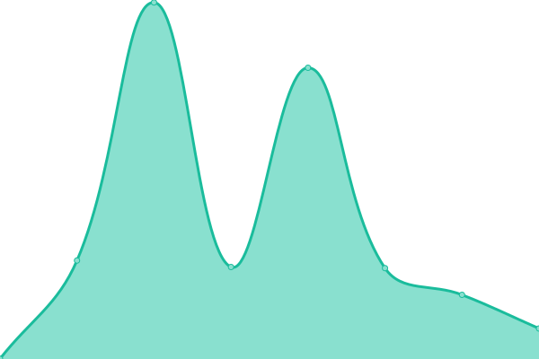

# [📈 Live Status](https://civcicd.github.io/uptime-monitor-commercial): <!--live status--> **🟧 Partial outage**

This repository contains the open-source uptime monitor and status page for [civcicd](https://civcicd.github.io/uptime-monitor-commercial), powered by [Upptime](https://github.com/upptime/upptime).

With [Upptime](https://upptime.js.org), you can get your own unlimited and free uptime monitor and status page, powered entirely by a GitHub repository. We use [Issues](https://github.com/civcicd/uptime-monitor-commercial/issues) as incident reports, [Actions](https://github.com/civcicd/uptime-monitor-commercial/actions) as uptime monitors, and [Pages](https://civcicd.github.io/uptime-monitor-commercial) for the status page.

<!--start: status pages-->
<!-- This summary is generated by Upptime (https://github.com/upptime/upptime) -->
<!-- Do not edit this manually, your changes will be overwritten -->
<!-- prettier-ignore -->
| URL | Status | History | Response Time | Uptime |
| --- | ------ | ------- | ------------- | ------ |
|  [Sparc](https://sparc.concorde2000.com) | 🟩 Up | [sparc.yml](https://github.com/civcicd/uptime-monitor-commercial/commits/HEAD/history/sparc.yml) | 

 291ms
     
 | 

<a href="https://uptime.concorde2000.com/history/sparc">100.00%</a>
    

|  [Concorde2000](https://www.concorde2000.com) | 🟩 Up | [concorde2000.yml](https://github.com/civcicd/uptime-monitor-commercial/commits/HEAD/history/concorde2000.yml) | 

 460ms
     
 | 

<a href="https://uptime.concorde2000.com/history/concorde2000">100.00%</a>
    

|  [Concorde Help](https://engage.concorde2000.com) | 🟩 Up | [concorde-help.yml](https://github.com/civcicd/uptime-monitor-commercial/commits/HEAD/history/concorde-help.yml) | 

 276ms
     
 | 

<a href="https://uptime.concorde2000.com/history/concorde-help">98.91%</a>
    

|  [Customer Support](https://customercare.concorde2000.com) | 🟥 Down | [customer-support.yml](https://github.com/civcicd/uptime-monitor-commercial/commits/HEAD/history/customer-support.yml) | 

 688ms
     
 | 

<a href="https://uptime.concorde2000.com/history/customer-support">0.00%</a>
    

|  [Drivers Clearinghouse](https://www.driversclearinghouse.com) | 🟩 Up | [drivers-clearinghouse.yml](https://github.com/civcicd/uptime-monitor-commercial/commits/HEAD/history/drivers-clearinghouse.yml) | 

 286ms
     
 | 

<a href="https://uptime.concorde2000.com/history/drivers-clearinghouse">100.00%</a>
    

|  [FastTest](https://fasttest.concorde2000.com/Login.aspx) | 🟩 Up | [fast-test.yml](https://github.com/civcicd/uptime-monitor-commercial/commits/HEAD/history/fast-test.yml) | 

 294ms
     
 | 

<a href="https://uptime.concorde2000.com/history/fast-test">100.00%</a>
    

|  [Smart](https://smart.concorde2000.com) | 🟩 Up | [smart.yml](https://github.com/civcicd/uptime-monitor-commercial/commits/HEAD/history/smart.yml) | 

 377ms
     
 | 

<a href="https://uptime.concorde2000.com/history/smart">100.00%</a>
    

|  [Concorde Admissions](https://concordeadmissions.com) | 🟩 Up | [concorde-admissions.yml](https://github.com/civcicd/uptime-monitor-commercial/commits/HEAD/history/concorde-admissions.yml) | 

 403ms
     
 | 

<a href="https://uptime.concorde2000.com/history/concorde-admissions">100.00%</a>
    

|  [Concorde Analytics](https://concordeanalytics.com) | 🟩 Up | [concorde-analytics.yml](https://github.com/civcicd/uptime-monitor-commercial/commits/HEAD/history/concorde-analytics.yml) | 

 670ms
     
 | 

<a href="https://uptime.concorde2000.com/history/concorde-analytics">100.00%</a>
    

|  [AppCheck](https://www09.8f7.com) | 🟩 Up | [app-check.yml](https://github.com/civcicd/uptime-monitor-commercial/commits/HEAD/history/app-check.yml) | 

 274ms
     
 | 

<a href="https://uptime.concorde2000.com/history/app-check">96.92%</a>
    

|  [AF E-Opto Api](https://af-e-opto-web-app-serv-api-01.azurewebsites.us) | 🟩 Up | [af-e-opto-api.yml](https://github.com/civcicd/uptime-monitor-commercial/commits/HEAD/history/af-e-opto-api.yml) | 

 332ms
     
 | 

<a href="https://uptime.concorde2000.com/history/af-e-opto-api">100.00%</a>
    

|  [AF Quick Errors Api](https://af-qk-errors-serv-api-01.azurewebsites.us) | 🟩 Up | [af-quick-errors-api.yml](https://github.com/civcicd/uptime-monitor-commercial/commits/HEAD/history/af-quick-errors-api.yml) | 

 339ms
     
 | 

<a href="https://uptime.concorde2000.com/history/af-quick-errors-api">100.00%</a>
    

|  [AF Password Reset Api](https://af-passwd-reset-app-serv-api-01.azurewebsites.us) | 🟩 Up | [af-password-reset-api.yml](https://github.com/civcicd/uptime-monitor-commercial/commits/HEAD/history/af-password-reset-api.yml) | 

 327ms
     
 | 

<a href="https://uptime.concorde2000.com/history/af-password-reset-api">100.00%</a>
    

<!--end: status pages-->

[**Visit our status website →**](https://civcicd.github.io/uptime-monitor-commercial)

## 📄 License

- Powered by: [Upptime](https://github.com/upptime/upptime)
- Code: [MIT](./LICENSE) © [Anand Chowdhary](https://anandchowdhary.com), supported by [Pabio](https://pabio.com)
- Data in the `./history` directory: [Open Database License](https://opendatacommons.org/licenses/odbl/1-0/)
